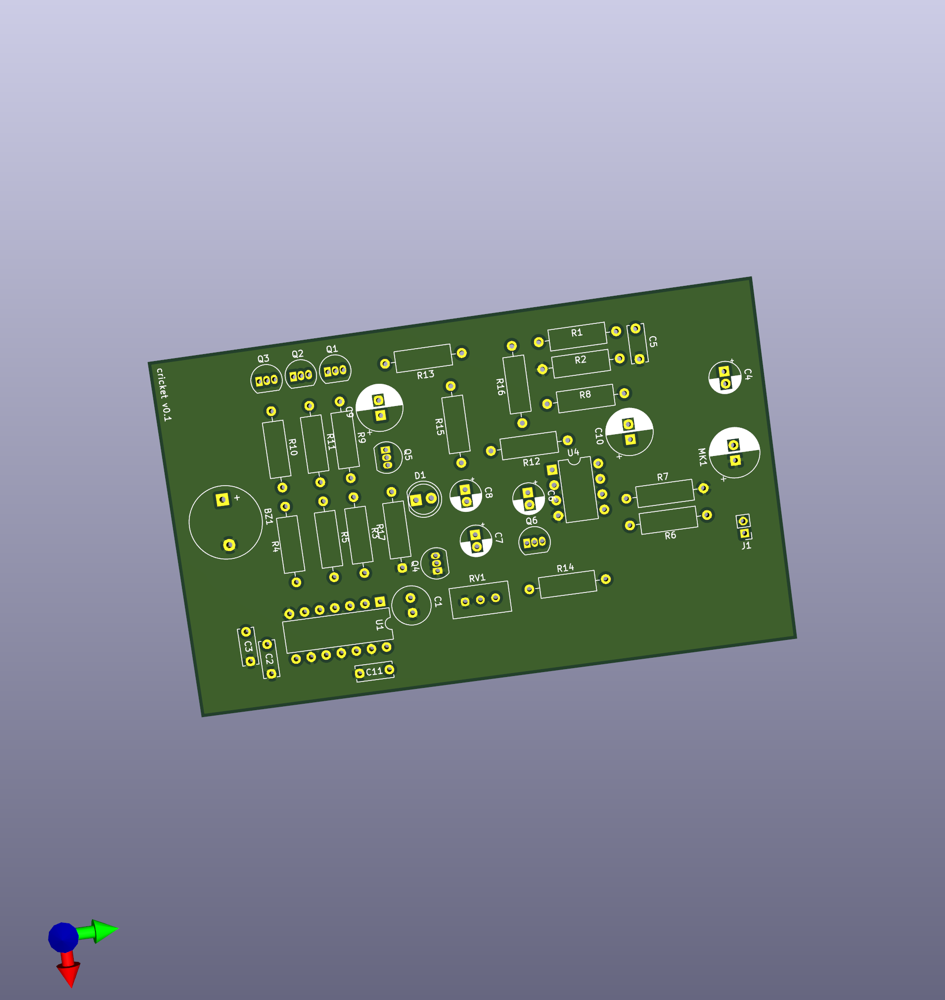
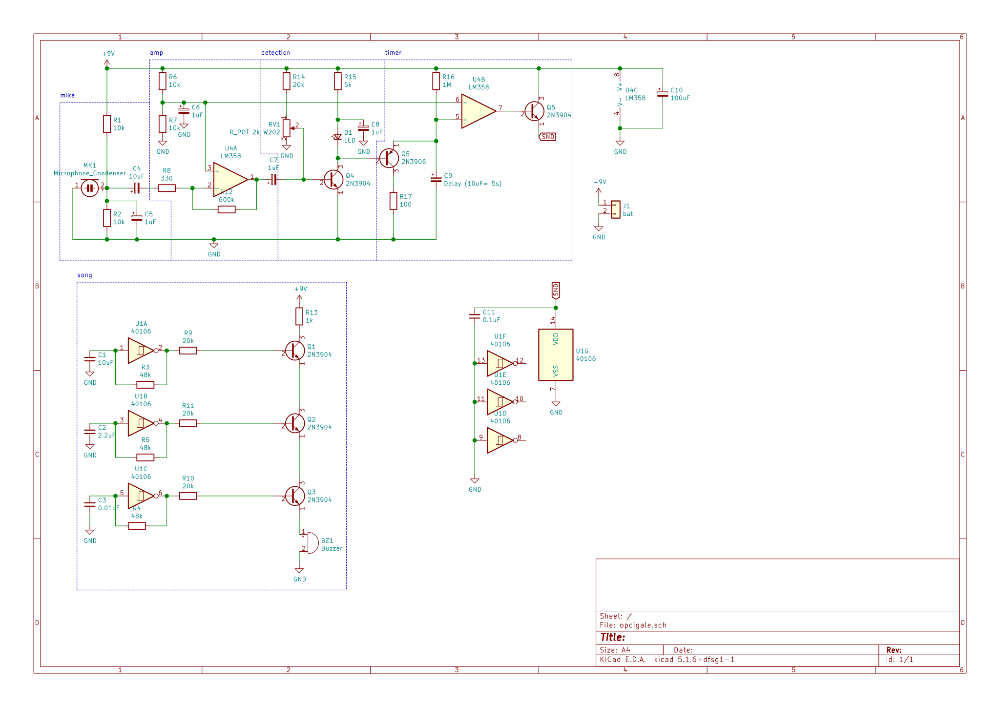

# Opcigale
This is an electronic thing that chirps like a cricket, when the environment is quiet.

I'm learning electronics with this - so don't take anything below for granted.

I hope this can be useful to learn. Feel free to send improvements.

## Spec
- After a long enough silence, it starts singing.
- Whenever a noise occurs, it stops singing.
- It should react to lower frequencies (<500hz) and have a relatively high pitched song, so that it doesn't stop for its own or similar cricket sounds.
- An LED blinks when it detects a sound.
- A few knobs allow to tune sensitivity, cricket song, etc.

## Todo
- inhibit sound signal when it turns on, to ignore noise in circuit
- add a photoresistor, to also require low luminosity to start singing

## Caveats
The circuit is sensitive to noise, e.g. when the song circuitry turns on.

## Design

### Microphone
An electret microphone is powered to its operating voltage of ~4.5v (specs vary).
C4 is decoupling the next stage from the DC signal. With an impedance of ~300 ohms at 500hz,
C5 helps throw higher frequencies away.

### Amplification
The first half of a dual op-amp is configured to amplify the smallest ~1mv spikes to a few
hundred millivolts. This is enough to detect a voice from a couple meters.

R6/R7 provide a reference voltage of 4.5v, and we power the op amp with +9v, 0v.
C6 and C10 attempt to reduce noise in the power line.

### Detection
There's a voltage divider provided by RV1 which will bias the transistor Q4
close to a base-emitter voltage of .6v - C7 removes DC (we're half-way at 4.5v)
from the amplifier stage and adds the AC signal to the base.

When Q4 turns on, led blinks (C8 buffers some current to reduce noise in circuit) and
the output of this stage (which is the base of Q5) pulls low.

By tuning RV1 we can make it more or less sensitive. I guess doing this tuning here
is not the most efficient way, as current leaks to led when we increase sensitivity,
producing a glow, but total consumption is still pretty low in the couple of mA range.

### Timer
C9 slowly charges through R16. Vary R or C to configure delay - it will reach 4.5v 
at 0.7 * RC - this is detected by the voltage comparator built with the second half
of the op-amp in U4B, borrowing the amplifier's voltage divider as its reference.

Works with LM358, but may need some biasing for op amps that don't want to work
too close to the rail voltages (0v here)?

With the debugging setup shown here (10uF and 1Mohm) this takes around 7 seconds.

Whenever the previous stage detects a noise, Q5 base is grounded, leading to C9
discharging into R17 via this transistor, which resets the timer.

When the charge reaches 4.5v, pin 7 of U4 turns high, which turns Q6 on, powering
on the full song stage below. There's a bit of electrical noise when this happens
and there should be a R limiting current going to that circuit.

There's no hysteresis on charge/discharge of C9 so we can have some startup
hesitations, especially when the C9 is set to charge very slow, and microphone
sensitivity is set high. Eventually as C9 charges we have more budget and the
next stage can start.

### Song
We use inverters to build three oscillators.

The .1uF/48k RC at U1C produces a 5khz high pitch sound. U1A and U1B provide two
slower oscillations, to manipulate the envelope.

## AQ
### Why opcigale
I wanted to have fun with electronics. I had an electret microphone, and no idea how it worked.
Cigale means cicada in french. But I guess I meant grillon, which is a cricket. I actually ignore
if cicadas shut up when you walk nearby.

First version was using transistors, hence this version is called "opcigale".
